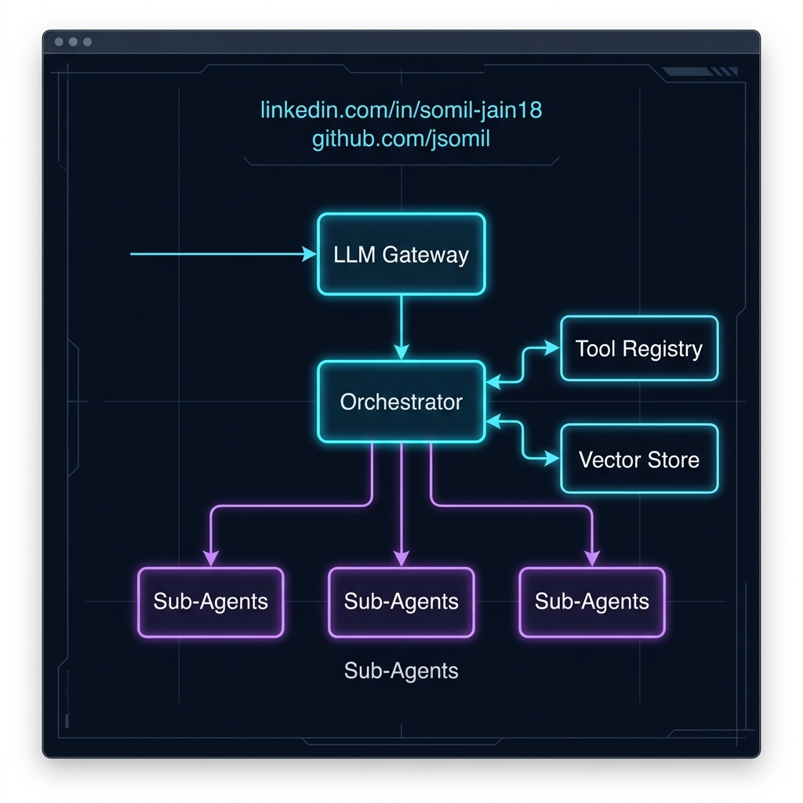

# AI System Design: Trade-offs in Agentic Architectures

When designing a production-grade agentic system from scratch, the hardest part isn't knowing what the components do. It's knowing how they connect, and defending those trade-offs.

Imagine a blank canvas. You have an orchestrator, sub-agents, memory module, tool registry, vector store, LLM gateway, observability layer, and guardrails.

I always start with the LLM gateway. Everything flows through it: routing, rate limits, cost tracking. Then the orchestrator breaks tasks and routes them to sub-agents. The tool registry ensures agents don't call tools directly, but go through a controlled layer.

But here is the real architectural debate: Where does memory live?

If you connect the Vector Store (Memory) directly to the Orchestrator, you have Centralised Memory. 
If you connect it at the sub-agent level, you have Distributed Memory.

Both work, but the trade-offs are significant:
Centralised memory is highly consistent. The orchestrator always has the global context.
Distributed memory is faster and isolated. Sub-agents can retrieve local context without bottlenecking the orchestrator.

Knowing what each component does isn't enough. You need to know:
- why it connects there?
- what breaks if you move it?
- what you gain and lose either way?

That's system design in AI. Not tools. Decisions.

Have you had to make this trade-off in your agentic workflows? How did you approach it?
